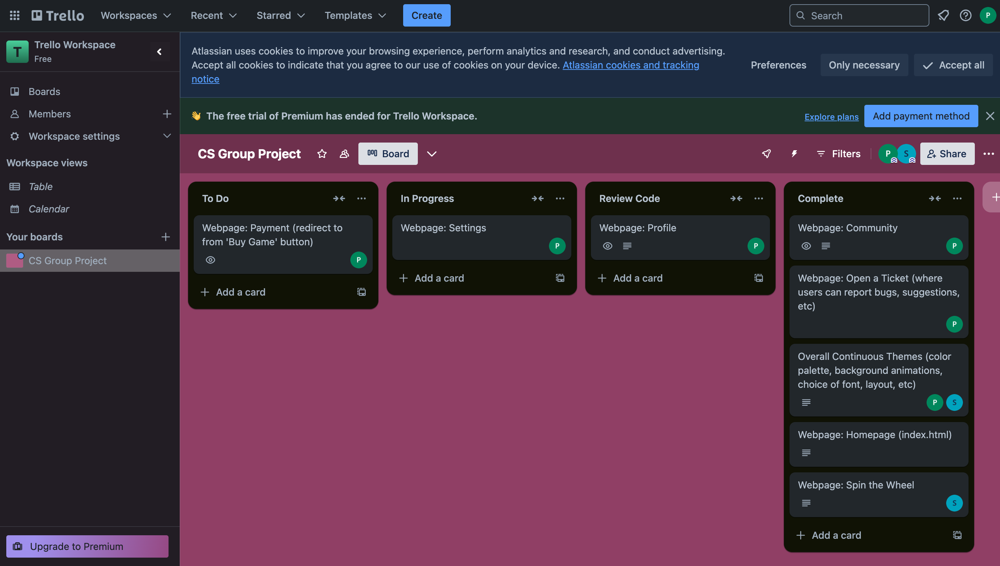
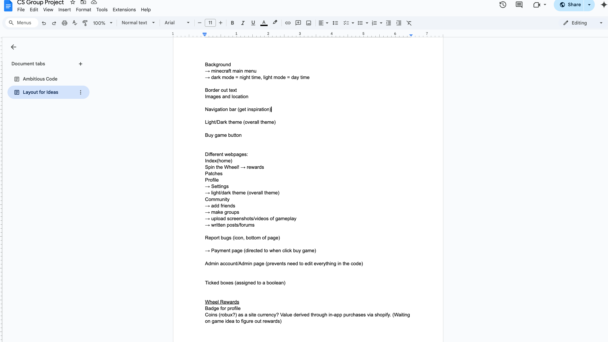

# GroupProject
**Vision:**
 
 
Promotional, Informational, interactive and integrated website based around our custom made roblox game. 

This loose but ambitious goal allowed us all to work on something we had an interest in and then come together to tailor it towards our game. Escape the Forest brings Aesthetics, js functionalities, animation, layout, backend, understanding new elements, overcoming github issues, team compromise, team info sharing, as well as some lua and c++ game development all together.

**Planning:**
- Trello: https://trello.com/invite/b/673768ab67bcc937cc3b810e/ATTIfb1225a751583063fb765d9a317c7bfdF66C50CE/cs-group-project 

- Google Drive Planning: https://docs.google.com/document/d/1XddWP7n2jCf5jx8xBisYjmphhyAHWxIHypW4U3ntGmc/edit?usp=sharing

- Text message and Discord correspondence
